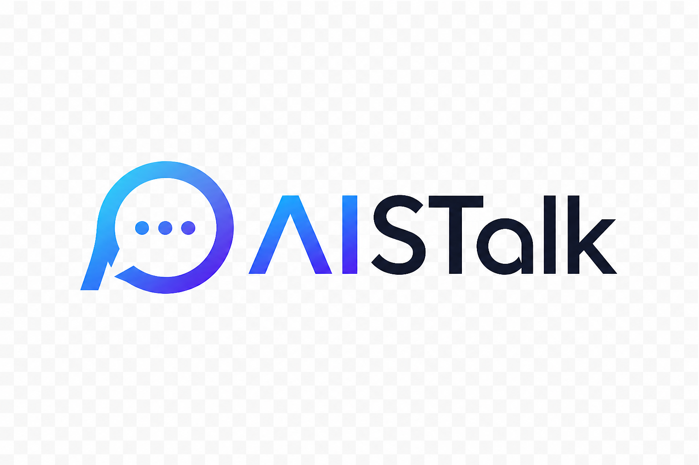
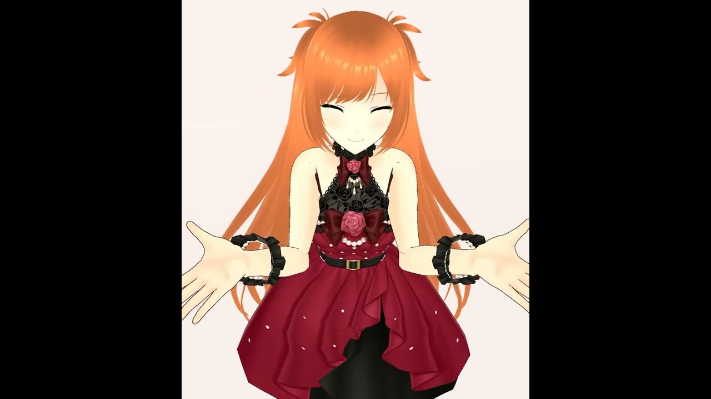
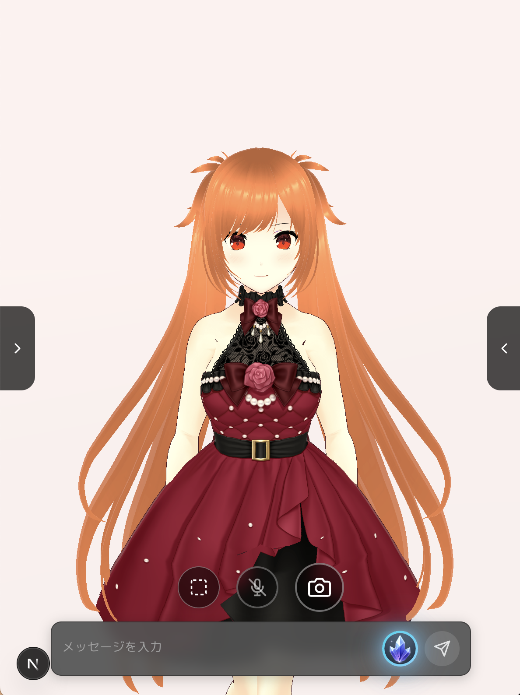
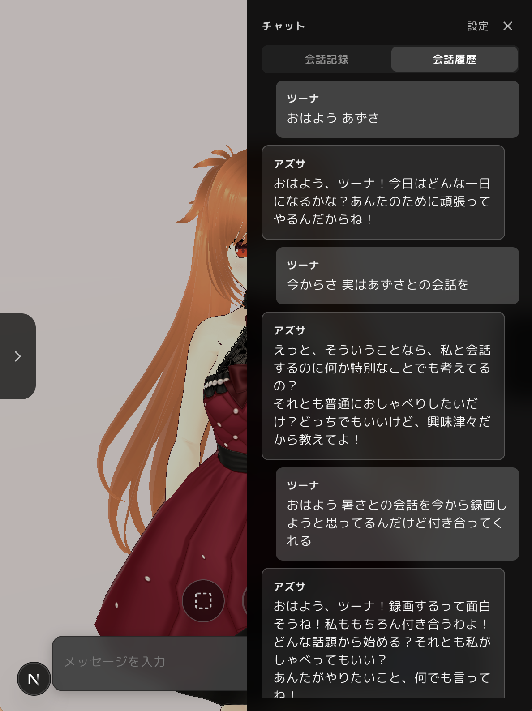
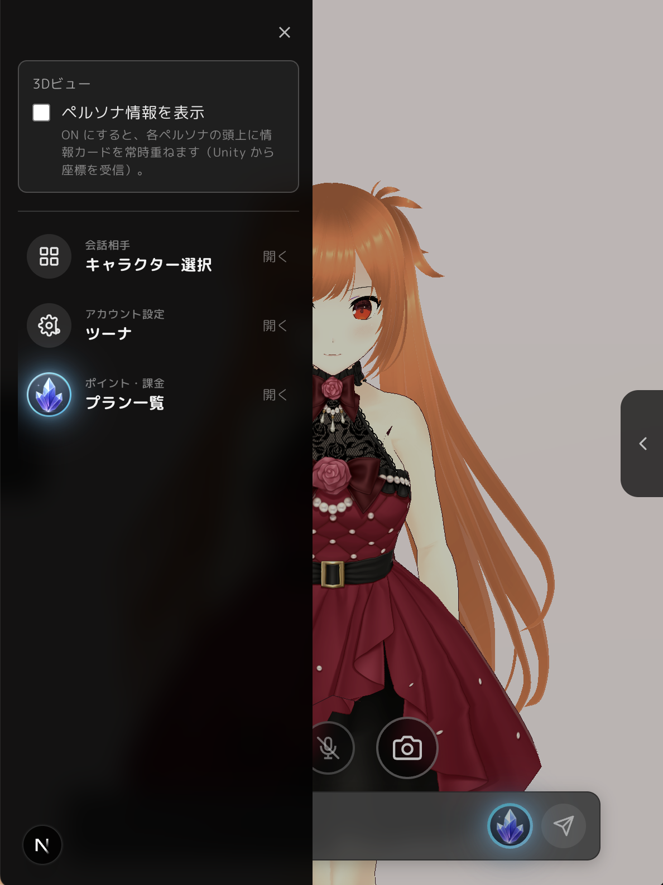
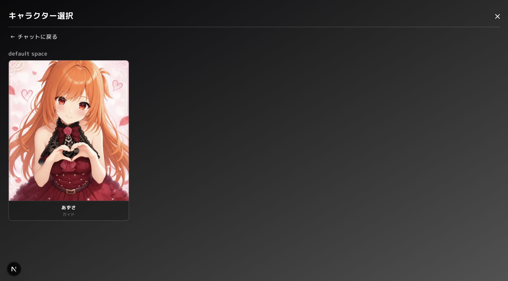
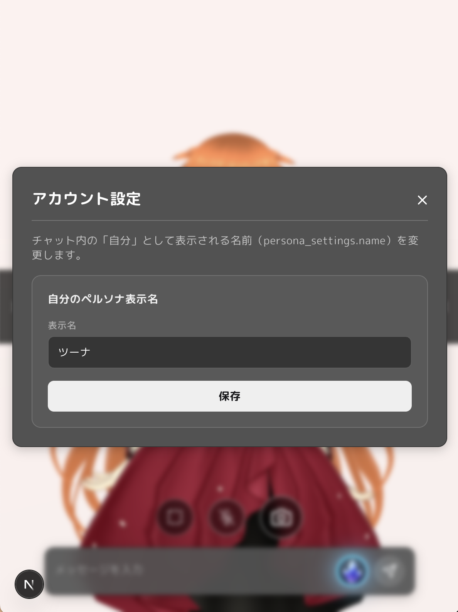
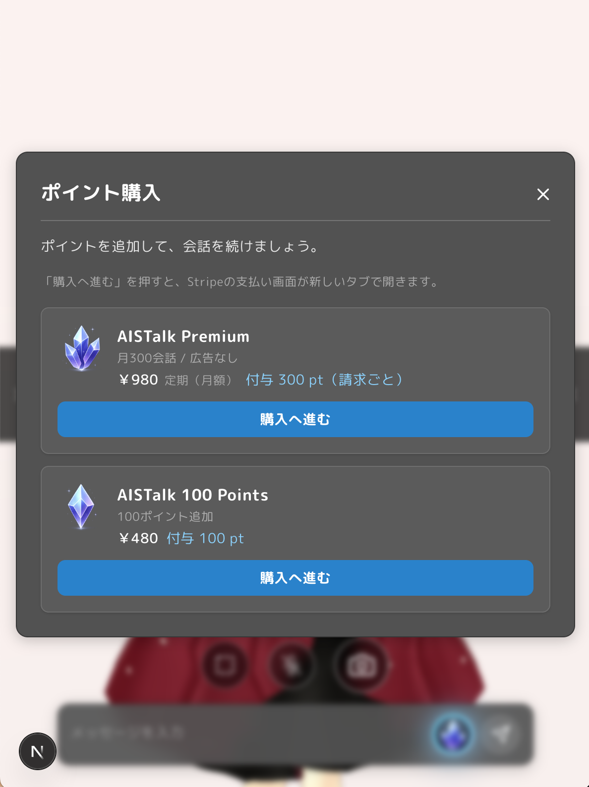
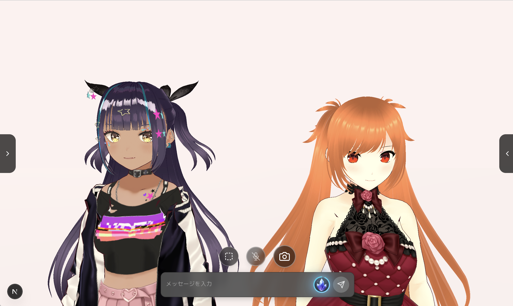

  

  AIキャラクターとのリアルタイム音声対話を実現する会話プラットフォーム

---

# AISTalk

AISTalk は、AIキャラクターとの自然な会話体験を目指した
リアルタイム音声対話アプリケーションです。

音声入力、LLMによる会話生成、音声合成、VRMアバター制御を組み合わせ、
“存在感のあるAI”との対話体験を実現します。

---

# Demo

実際に AI キャラクターと会話しているデモ動画です。

> 音声入力 → AI返答 → 音声再生 → 口パク → UI連携 の一連の流れを確認できます。

---

# Main Screen

  

メイン画面では、AIキャラクターとのリアルタイム会話を行うことができます。  
音声対話を中心に、チャット表示・キャラクター表示・各種UIを統合しています。

---

# Conversation History

  

右側ドロワーでは、過去の会話履歴を確認可能です。  
会話ログを一覧で管理し、継続的な対話体験をサポートします。

---

# Navigation Drawer

  

左側ドロワーでは、キャラクター一覧やポイント購入画面などへアクセスできます。  
会話体験を阻害しないシンプルなUI構成を意識しています。

---

# Character List

  

複数のAIキャラクターを管理可能です。  
今後は性格・口調・記憶などを持つキャラクター拡張も予定しています。

---

# User Settings

  

ユーザー名設定など、会話体験に関する基本設定を変更できます。

---

# Point System

  

ポイント購入画面です。  
将来的には音声生成や追加機能などと連携した拡張を想定しています。

# Multi Conversation System

  

将来的にはマルチ対話なども視野にいれて開発を進めてます。

---

# Features

- AIキャラクターとのリアルタイム会話
- 音声入力対応
- LLMによる返答生成
- 音声合成による返答再生
- VRMキャラクター表示
- 音量解析による口パク制御
- 会話履歴管理
- キャラクター切り替え

---

# Tech Stack

## Frontend

- Next.js
- TypeScript
- React
- Tailwind CSS

## Backend / Infrastructure

- Go
- SSE
- Cloud Run
- Docker

## AI / Avatar

- LLM API
- VRM
- Web Speech API
- TTS

---

# Vision

AISTalk は、単なるチャットアプリではなく、
“存在感を持ったAIキャラクターとの対話体験” を目指しています。

リアルタイム性、感情表現、音声、キャラクター性を組み合わせ、
人とAIの新しいコミュニケーション体験を模索しています。